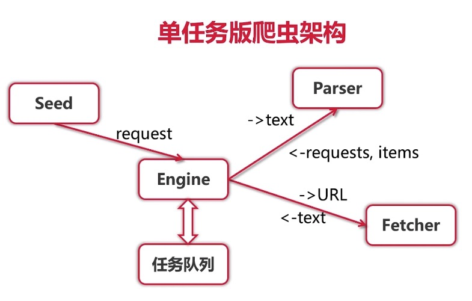
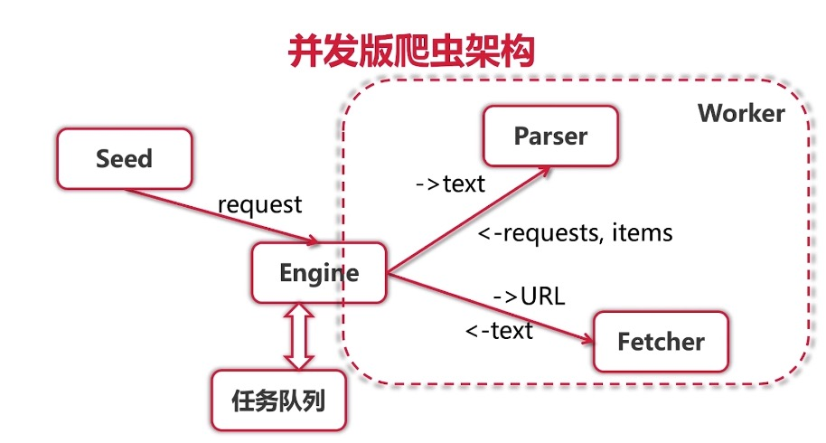

# Golang 爬虫




### 获取珍爱网所有城市第一页用户的详情

* **Fetcher 获取目标页面代码**

```text
http.Get(url) 获取页面源代码
源代码可能不是utf8的编码类型
所以引入库golang.org/x/net/html/charset，golang.org/x/text/transform
charset.DetermineEncoding确定代码的编码类型
transform.NewReader将指定编码类型转换成utf8
```


若浏览器可以直接访问, 但http.Get\(url\)报403, 则需要在请求设置User-Agent  （[https://www.cnblogs.com/haoprogrammer/p/10696027.html](https://www.cnblogs.com/haoprogrammer/p/10696027.html)）



* **城市列表parser \(获取城市列表与城市详情页url\)**

```text
从上一步中能获取到整个页面的源代码
页面中城市列表的代码
<a href="http://www.zhenai.com/zhenghun/aomen" data-v-5e16505f>中国澳门</a>
<a href="http://www.zhenai.com/zhenghun/baicheng1" data-v-5e16505f>白城</a>
...
要匹配的就是:
<a href="(http://www.zhenai.com/zhenghun/[0-9a-z]+)" data-v-5e16505f>([^<]+)</a>
```


* **城市详情parser \(获取用户列表与用户详情页url\)**

```text
该parser和城市列表parse思路一致
列表中某个用户页面的代码
<a href="http://album.zhenai.com/u/1141852519" target="_blank">向往</a>
正则匹配：<a href="http://album.zhenai.com/u/[0-9]+".*>[^<]+</a>
```

### 并发版Crawler

* 单任务爬虫: 每次Fetcher\(获取页面代码\),都发送一次http请求,并且等待该请求结果返回后才进行parser,然后才进行下一个任务.
* 并发版爬虫: Fetcher的输出就是Parser的输入,将这部分当作一个worker,分配一个goRoutine.即可让多个任务同时进行.




#### 将获取的数据存入ElasticSearch

```text
client,err:=elastic.NewClient(elastic.SetSniff(false))//turn off sniff in docker
indexService:=client.Index().Index(index).Type(item.Type).BodyJson(item)
if item.Id !=""{
	indexService.Id(item.Id)
}
_,err=indexService.Do(context.Background())		
```


在docker中部署ElasticSearch [https://www.cnblogs.com/jianxuanbing/p/9410800.html](https://www.cnblogs.com/jianxuanbing/p/9410800.html)


### 分布式Crawler


